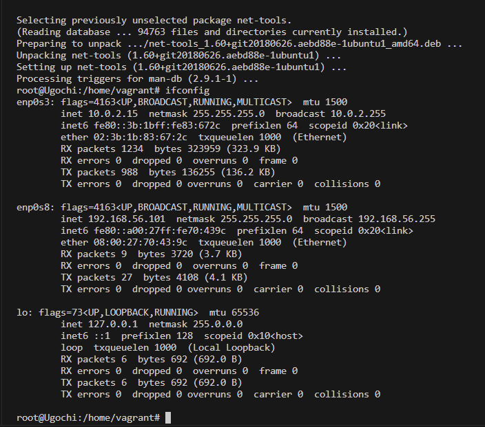

# EXERCISE 1

## TASK: 
- Setup Ubuntu 20.04 LTS on your local machine using vagrant.

## Instruction
- Customize your vagrant file as necessary with private_network set to dhcp.
- Once the machine is up, run ifconfig and share the output in your submission along with your vagrantfile in a folder for this exercise.

## BREAKDOWN OF THE SOLUTION

I I downloaded Virtual box and Vagrant. While configuring my private network, I set it to dhcp following the instruction giving but I encountered a problem while running vagrant up.

This was the message

To solve this, I went to the network tools for the Virtual machine on Virtual box, got the netmask, ip and the lower and upper boundary for the Ip and the two machines connected.

For the second question, this is the result from inputting the command ifconfig
