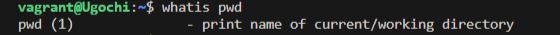
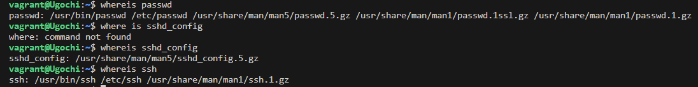
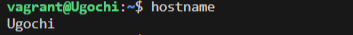
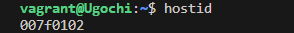
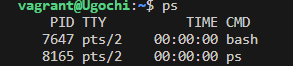
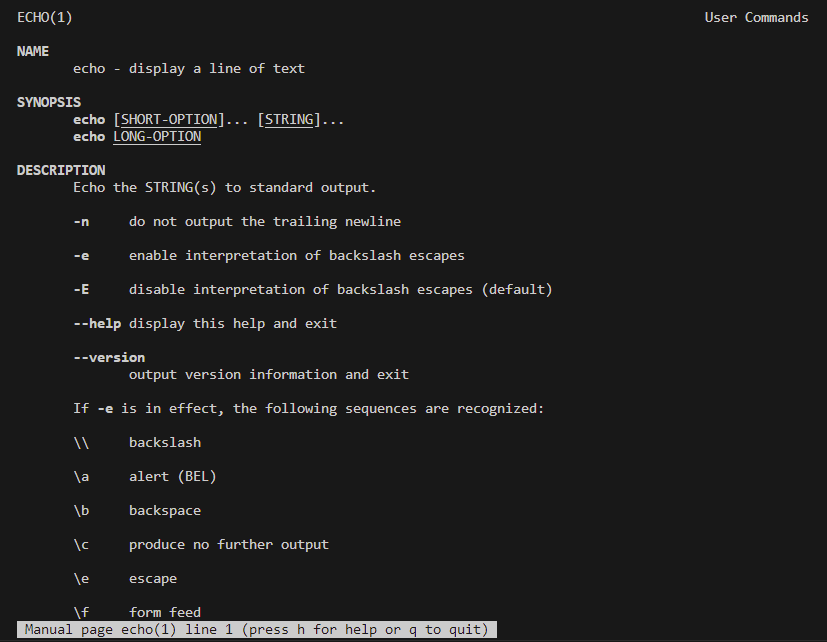
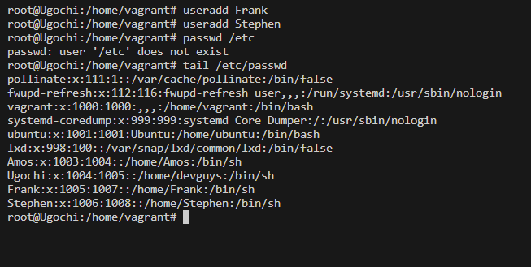
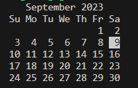
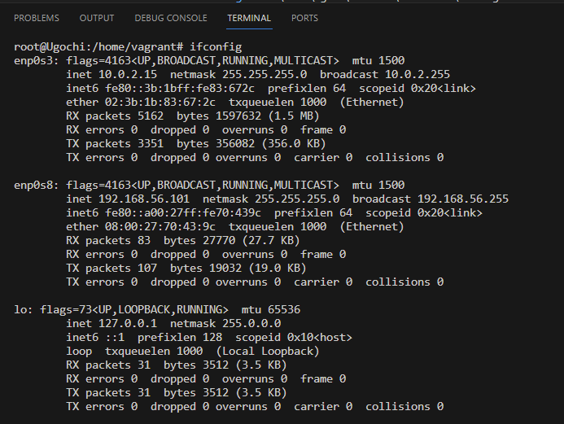

# EXERCISE  2

## TASK:
- Research online for 10 more commands asides the ones already mentioned in this module. submit using your "altschool-cloud-exercise project", explaining what each command is used for with examples of how to use each and examples screenshot of using them.

## Instruction:
- Submit your work in a folder for this exercise in your altschool-cloud-exercises project.

## SOLUTION TO THE EXERCISE

## Ten Linux Commands
1. `whatis` --- Find what a command is used for.

2. `whereis` --- To locate the command's binary, source and manual pages.

From the image, you can see that there should be no whitespace between 'where' and 'is' as it will lead to an error. The same applies to whatis.

3. `hostname` --- This command is used to obtain the domain name.

4. `hostid` --- To display the hostid in hexadecimal format.

5. `ps` --- The command is used to list the current processes and their PIDs along with some other options.

6. `man` --- man along side any command is used to display different options you can use the command to do.

for instance: man echo prints this result

7. `useradd` --- This command is used to create new users.

From the image, you can see the users were added when `tail /etc/passwd`  was inputted.

`/etc/passwd`  shows the list of users created.

8. `tail` --- This command is used to show the last ten lines in a long list

9. `cal` --- This command is used to dispaly the date on a calendar.

10. `ifconfig` --- This command is used to display network interfaces and IP addressses.

