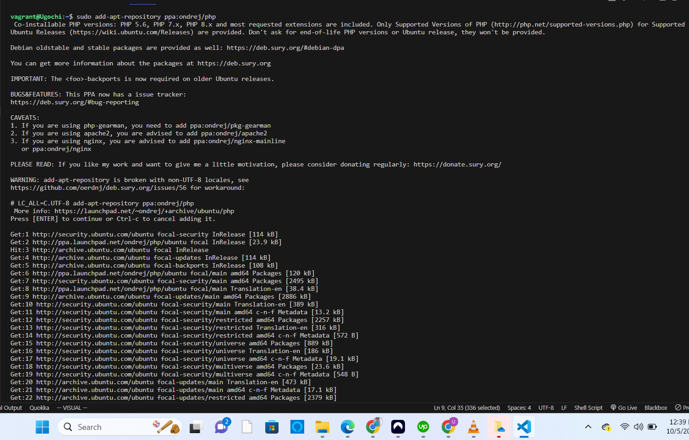
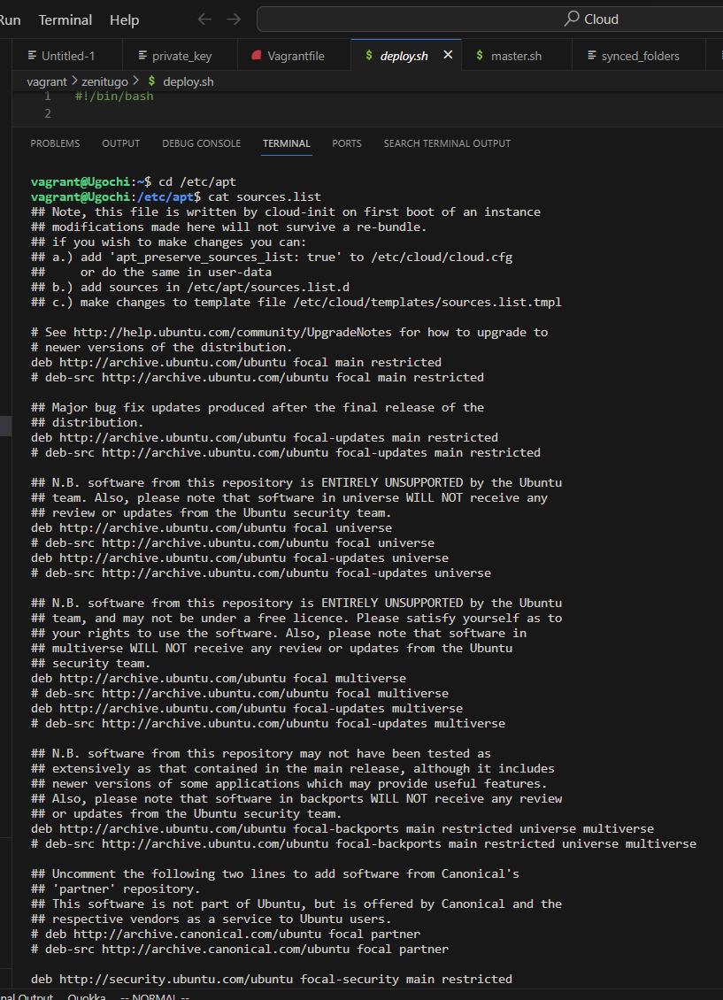
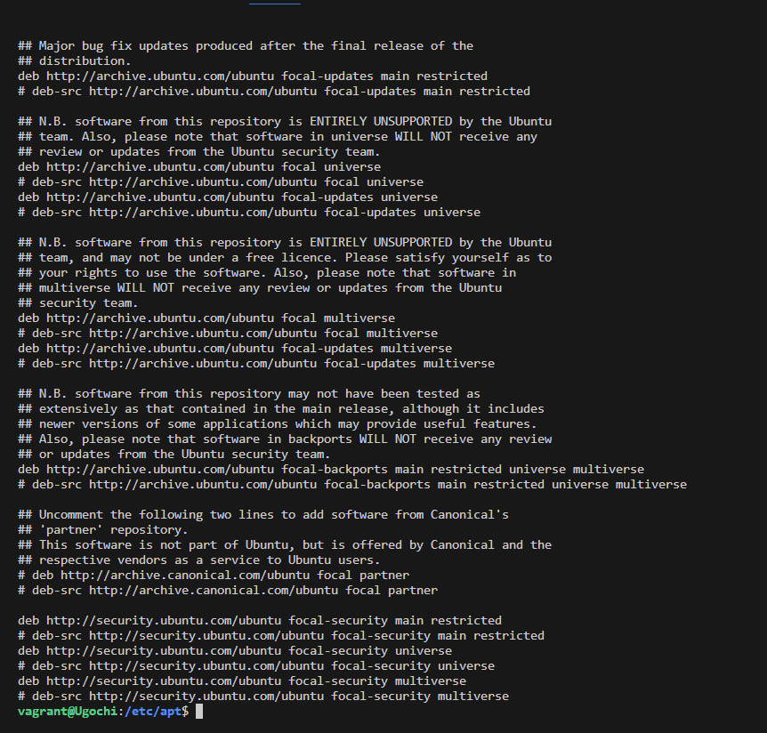

# Exercise 

**Task**:
- Install PHP 7.4 on your local linux machine using the ppa:ondrej/php package repo.

**Instruction**:
- Learn how to use the add-apt-repository command.
- Submit the content of /etc/apt/sources.list and the output of php -v command.

## Solution

The first thing I did was to check if software-properties-common package was installed.

I did that by running the command `sudo apt list --installed software-properties* -a `

Since the repository is not a regular one but ppa, I used this syntax
`add-apt-repository ppa:<user>/<ppa_name>` which means I ran the command
`add-apt-repository ppa:ondrej/php` followed by `sudo apt install php4 -y`

This is the image of the installation

## The content of /etc/apt/sources.list 

## The output of php-v command
PHP 7.4.33 (cli) (built: Sep  2 2023 08:03:15) ( NTS )
Copyright (c) The PHP Group
Zend Engine v3.4.0, Copyright (c) Zend Technologies
    with Zend OPcache v7.4.33, Copyright (c), by Zend Technologies

